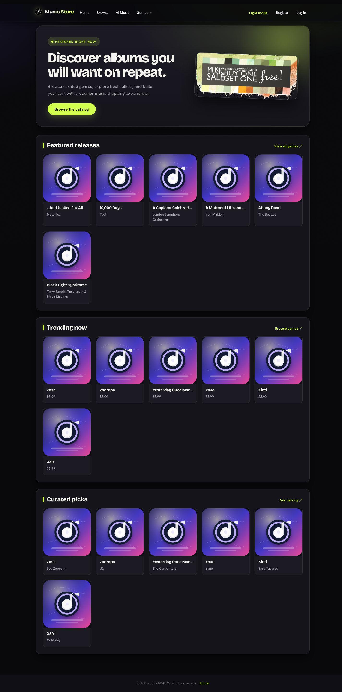
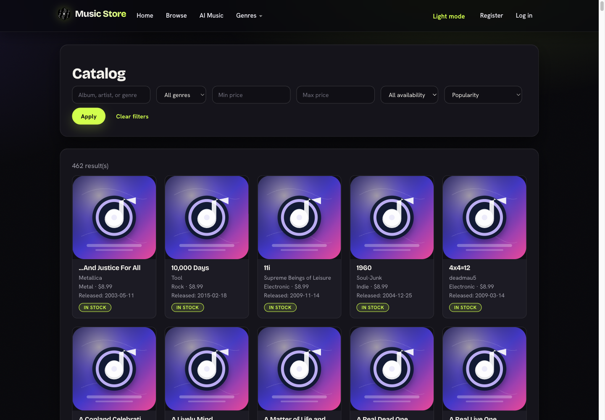
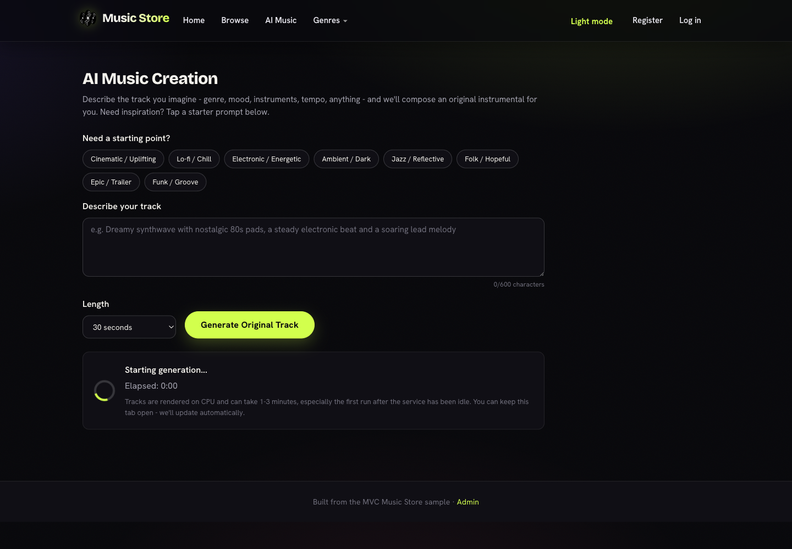
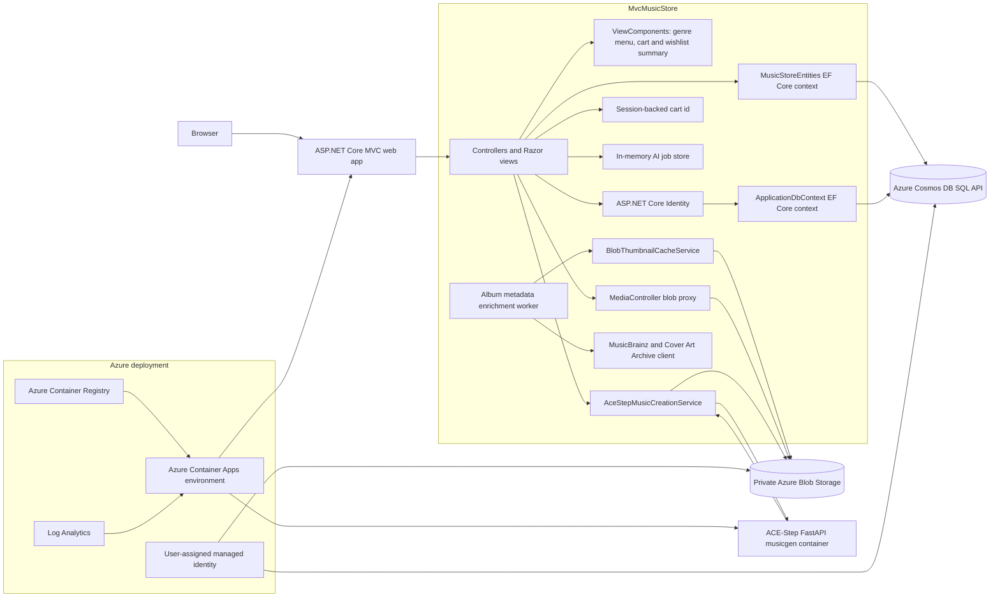

# MVC Music Store

An upgraded ASP.NET Core MVC version of the classic MVC Music Store sample, running on .NET 10 with Azure Cosmos DB, private Azure Blob Storage media, ASP.NET Core Identity, and an optional ACE-Step text-to-music generation service.

The app is still a lightweight sample store that sells music albums online, but it now includes a modern dark-first storefront, searchable catalog, administration, sign-in, shopping cart, wishlist (save for later), checkout, metadata artwork enrichment, and an AI Music flow that can generate original instrumental tracks and publish them back into the catalog.

## Screenshots

| Home | Catalog | AI Music |
| --- | --- | --- |
|  |  |  |

## Repository layout

| Path | Purpose |
| --- | --- |
| `src/MvcMusicStore` | ASP.NET Core MVC web app, controllers, Razor views, models, EF Core contexts, static assets, and web Dockerfile. |
| `src/musicgen` | FastAPI wrapper around ACE-Step 1.5 text-to-music generation, exposed to the web app through `/generate`. |
| `infra` | Azure Bicep for Container Apps, Container Registry, Cosmos DB, Storage, managed identity, and role assignments. |
| `.github/workflows/deploy.yml` | OIDC-based GitHub Actions deployment to Azure Container Apps. |
| `docs/assets` | README screenshots captured from the running application. |

## Architecture



### Runtime components

| Component | Implementation | Responsibilities |
| --- | --- | --- |
| Web app | `src/MvcMusicStore/Program.cs` | Registers MVC, EF Core Cosmos contexts, Identity, sessions, Blob Storage, HTTP clients, hosted workers, and the default MVC route. |
| Storefront | `HomeController`, `StoreController`, Razor views | Home page sections, catalog search/filter/sort, genre browsing, album details, and artist pages. |
| Shopping and checkout | `ShoppingCartController`, `CheckoutController`, `ShoppingCart` | Session-based cart identity, persisted cart rows, order creation, and order detail ownership. |
| Administration | `StoreManagerController` | Administrator-only CRUD for albums plus custom thumbnail uploads and metadata artwork lookup. |
| Authentication | `AccountController`, `ApplicationDbContext` | ASP.NET Core Identity users, roles, claims, logins, and tokens stored in Cosmos containers. |
| Media | `MediaController` | Streams private Blob Storage thumbnails and generated music through `/media/thumbnails/...` and `/media/music/...`. |
| Metadata enrichment | `AlbumMetadataEnrichmentWorker`, `MusicBrainzAlbumArtworkService` | Periodically enriches albums with release dates and cached cover art from MusicBrainz and Cover Art Archive. |
| AI Music | `AiMusicController`, `AceStepMusicCreationService`, `AiMusicJobStore` | Starts asynchronous generation jobs, polls job status, calls musicgen, uploads MP3 output to Blob Storage, and inserts the generated track as a catalog album. |
| Music generation | `src/musicgen/app.py` | FastAPI service that loads ACE-Step 1.5, generates MP3 audio from a prompt, and returns base64 audio to the web app. |

### Data model

The application uses EF Core's Azure Cosmos DB provider for both catalog data and Identity data. The app creates the database and containers at startup through `Database.EnsureCreatedAsync()` and seeds sample catalog data plus an administrator account.

| Container family | Entities |
| --- | --- |
| Catalog | `Albums`, `Genres`, `Artists`, `Carts`, `Orders` |
| Identity | `Identity_Users`, `Identity_Roles`, `Identity_UserClaims`, `Identity_UserRoles`, `Identity_UserLogins`, `Identity_RoleClaims`, `Identity_UserTokens` |

Catalog entities denormalize display fields such as artist name, genre name, album art URL, release date, availability, and generated audio URL so storefront pages can render from Cosmos without relational joins. Orders own their order details as embedded data.

### Media and thumbnail flow

Album thumbnails resolve in this order:

1. Uploaded custom image.
2. Cached metadata artwork from MusicBrainz/Cover Art Archive.
3. Original album art URL.
4. Local placeholder image.

Metadata thumbnails and generated MP3 files are stored in private Blob Storage containers. The web app serves them through `MediaController` so Azure deployments can keep blob public access disabled and use managed identity for storage access.

### AI music flow

1. The browser posts a prompt and duration to `AiMusicController.Start`.
2. The controller creates an in-memory `AiMusicJob` and returns a job ID immediately.
3. A background task calls `AceStepMusicCreationService`.
4. The service rejects prompts that ask to copy or recreate existing works, builds a model prompt, and calls `src/musicgen` at `/generate`.
5. The musicgen container returns base64 MP3 audio, duration, seed, and model metadata.
6. The web app uploads the MP3 to the `music` blob container.
7. A new `Album` and, when needed, `Artist` are saved to Cosmos.
8. The browser polls `AiMusicController.Status` until it receives the catalog album ID and audio URL.

## Running locally

Prerequisites:

- .NET 10 SDK.
- Azure Cosmos DB Emulator or a Cosmos DB account.
- Azurite or an Azure Storage account for blob-backed thumbnails and generated music.
- Docker, if you want the ACE-Step music generation service to produce audio locally.

The development settings in `src/MvcMusicStore/appsettings.Development.json` point to a local Cosmos emulator on `http://localhost:8081`, Azurite on `http://127.0.0.1:10000`, and musicgen on `http://localhost:8000`.

From the repository root:

```bash
dotnet restore src/MvcMusicStore/MvcMusicStore.csproj
dotnet build src/MvcMusicStore/MvcMusicStore.csproj
cd src/MvcMusicStore
ASPNETCORE_ENVIRONMENT=Development ASPNETCORE_URLS=http://127.0.0.1:5090 dotnet run --no-build
```

Open `http://127.0.0.1:5090/`.

The default administrator account is configured by `AppSettings:DefaultAdminUsername` and `AppSettings:DefaultAdminPassword`. Change the password before using any shared environment.

### Running local music generation

The web app can run without musicgen, but AI Music will only save metadata unless `MusicGen:BaseUrl` points to a running generation service.

```bash
docker build -t musicgen-test src/musicgen
docker run --rm -p 8000:8000 musicgen-test
```

Then start the web app in Development mode. The development configuration already uses `http://localhost:8000`.

## Azure deployment

The `infra` folder provisions:

- Resource group.
- Azure Container Apps environment with a Consumption profile for the web app and a dedicated `musicgen` workload profile.
- Azure Container Registry.
- User-assigned managed identity.
- Azure Cosmos DB SQL API database.
- Azure Storage account with private `thumbnails` and `music` blob containers.
- Log Analytics workspace.
- Role assignments for ACR pull, Cosmos data contributor, and Storage Blob Data Contributor.

The web container receives Cosmos endpoint, storage blob endpoint, container names, musicgen internal URL, managed identity client ID, and admin credentials through Container Apps environment variables and secrets. The musicgen container is internal-only and is called by the web app inside the Container Apps environment.

`azure.yaml` defines both deployable services:

| Service | Project | Host |
| --- | --- | --- |
| `web` | `src/MvcMusicStore` | Azure Container Apps |
| `musicgen` | `src/musicgen` | Azure Container Apps |

## CI/CD

`.github/workflows/deploy.yml` builds and deploys changed services on pushes to `main`, or manually through `workflow_dispatch`.

- Web changes build `src/MvcMusicStore` in ACR and update the web Container App.
- Musicgen changes build `src/musicgen` in ACR and update the internal musicgen Container App.
- Authentication uses GitHub OIDC through `azure/login`; no registry passwords or client secrets are stored in the workflow.

## Additional resources

The original tutorial documentation is available on [Microsoft Learn](https://learn.microsoft.com/en-us/aspnet/mvc/overview/older-versions/mvc-music-store/).
