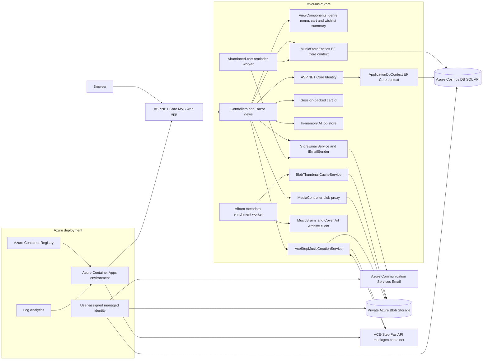

# MVC Music Store

An upgraded ASP.NET Core MVC version of the classic MVC Music Store sample, running on .NET 10 with Azure Cosmos DB, private Azure Blob Storage media, ASP.NET Core Identity, and an optional ACE-Step text-to-music generation service.

The app is still a lightweight sample store that sells music albums online, but it now includes a modern dark-first storefront, searchable catalog, verified-purchaser ratings and reviews, administration, sign-in, shopping cart, wishlist (save for later), checkout, a loyalty rewards and referral program, digital gift cards and album gifting, metadata artwork enrichment, and an AI Music flow that can generate original instrumental tracks and publish them back into the catalog.

## Screenshots

| Home | Catalog | AI Music |
| --- | --- | --- |
|  |  |  |

## Repository layout

| Path | Purpose |
| --- | --- |
| `src/MvcMusicStore` | ASP.NET Core MVC web app, controllers, Razor views, models, EF Core contexts, static assets, and web Dockerfile. |
| `src/musicgen` | FastAPI wrapper around ACE-Step 1.5 text-to-music generation, exposed to the web app through `/generate`. |
| `infra` | Azure Bicep for Container Apps, Container Registry, Cosmos DB, Storage, managed identity, and role assignments. |
| `.github/workflows/deploy.yml` | OIDC-based GitHub Actions deployment to Azure Container Apps. |
| `docs/assets` | README screenshots captured from the running application. |

## Architecture



### Runtime components

| Component | Implementation | Responsibilities |
| --- | --- | --- |
| Web app | `src/MvcMusicStore/Program.cs` | Registers MVC, EF Core Cosmos contexts, Identity, sessions, Blob Storage, HTTP clients, hosted workers, and the default MVC route. |
| Storefront | `HomeController`, `StoreController`, Razor views | Home page sections, catalog search/filter/sort, genre browsing, album details, and artist pages. |
| Ratings and reviews | `ReviewsController`, `StoreController`, `StoreManagerController` | Verified-purchaser star ratings and written reviews, average rating + count on catalog and album details, rating sort, paginated reviews, user reporting, and admin hide/remove moderation. |
| Shopping and checkout | `ShoppingCartController`, `CheckoutController`, `ShoppingCart` | Session-based cart identity, persisted cart rows, Stripe Checkout payment with optional loyalty and gift-card balances and the `FREE` promo, order finalization on capture, and the Stripe webhook. |
| Order history | `OrderController` | Signed-in shoppers review their past orders and per-order payment status. |
| Gift cards and gifting | `GiftCardController`, `GiftController`, `GiftCardService`, `LoggingEmailSender` | Buy digital gift cards delivered to a recipient by email, redeem balances at checkout, and send albums as a redeemable gift link. Email delivery is simulated through `IEmailSender`. |
| Administration | `StoreManagerController` | Administrator-only CRUD for albums plus custom thumbnail uploads, metadata artwork lookup, and order/refund management. |
| Authentication | `AccountController`, `ApplicationDbContext` | ASP.NET Core Identity users, roles, claims, logins, and tokens stored in Cosmos containers. |
| Loyalty &amp; referrals | `LoyaltyService`, `CheckoutController`, `AccountController`, `LoyaltySummaryViewComponent` | Points earned per purchase with tiered earn multipliers by lifetime spend, points redeemed for a checkout discount, a `/Account/Rewards` dashboard, and a referral program that rewards both parties after the referred customer's first purchase. |
| Media | `MediaController` | Streams private Blob Storage thumbnails and generated music through `/media/thumbnails/...` and `/media/music/...`. |
| Metadata enrichment | `AlbumMetadataEnrichmentWorker`, `MusicBrainzAlbumArtworkService` | Periodically enriches albums with release dates and cached cover art from MusicBrainz and Cover Art Archive. |
| Email and cart recovery | `StoreEmailService`, `EmailTemplateService`, `IEmailSender` (`AcsEmailSender`/`LoggingEmailSender`), `AbandonedCartReminderWorker` | Sends transactional order receipts, recovers abandoned carts for opted-in signed-in users, and honors marketing consent and unsubscribe. |
| AI Music | `AiMusicController`, `AceStepMusicCreationService`, `AiMusicJobStore` | Starts asynchronous generation jobs, polls job status, calls musicgen, uploads MP3 output to Blob Storage, and inserts the generated track as a catalog album. |
| Music generation | `src/musicgen/app.py` | FastAPI service that loads ACE-Step 1.5, generates MP3 audio from a prompt, and returns base64 audio to the web app. |

### Data model

The application uses EF Core's Azure Cosmos DB provider for both catalog data and Identity data. The app creates the database and containers at startup through `Database.EnsureCreatedAsync()` and seeds sample catalog data plus an administrator account.

| Container family | Entities |
| --- | --- |
| Catalog | `Albums`, `Genres`, `Artists`, `Carts`, `Orders`, `Reviews`, `GiftCards`, `Gifts` |
| Identity | `Identity_Users`, `Identity_Roles`, `Identity_UserClaims`, `Identity_UserRoles`, `Identity_UserLogins`, `Identity_RoleClaims`, `Identity_UserTokens` |

Catalog entities denormalize display fields such as artist name, genre name, album art URL, release date, availability, and generated audio URL so storefront pages can render from Cosmos without relational joins. Orders own their order details as embedded data and carry payment state (status, provider, checkout session reference, payment intent, and paid date), and gift cards own their transaction history the same way. Gift cards and album gifts carry their own redeemable code or token plus running balance and redemption state.

`Identity_Users` records also carry loyalty state (points balance, lifetime spend, lifetime points earned, tier eligibility, referral code, and referred-by code), and `Orders` record any points redeemed, the loyalty discount applied, and points earned. The loyalty economy (earn rate, redemption rate, tier thresholds, and referral rewards) is configured under the `Loyalty` section of `appsettings.json`.

### Media and thumbnail flow

Album thumbnails resolve in this order:

1. Uploaded custom image.
2. Cached metadata artwork from MusicBrainz/Cover Art Archive.
3. Original album art URL.
4. Local placeholder image.

Metadata thumbnails and generated MP3 files are stored in private Blob Storage containers. The web app serves them through `MediaController` so Azure deployments can keep blob public access disabled and use managed identity for storage access.

### AI music flow

1. The browser posts a prompt and duration to `AiMusicController.Start`.
2. The controller creates an in-memory `AiMusicJob` and returns a job ID immediately.
3. A background task calls `AceStepMusicCreationService`.
4. The service rejects prompts that ask to copy or recreate existing works, builds a model prompt, and calls `src/musicgen` at `/generate`.
5. The musicgen container returns base64 MP3 audio, duration, seed, and model metadata.
6. The web app uploads the MP3 to the `music` blob container.
7. A new `Album` and, when needed, `Artist` are saved to Cosmos.
8. The browser polls `AiMusicController.Status` until it receives the catalog album ID and audio URL.

### Checkout and payment flow

Checkout uses **Stripe Checkout** in hosted-redirect mode, so raw card data never touches the app.

1. The shopper submits the address form. Leaving the promo code blank starts a card payment; the promotional code `FREE` instead places a $0 order and skips Stripe.
2. A `Pending` order is persisted (so the address and line items survive the redirect) and the cart is left intact. The shopper is redirected to the Stripe-hosted payment page.
3. On success Stripe redirects to `/Checkout/Complete?session_id=...`; the app verifies the session, marks the order `Paid`, records the payment intent, and clears the cart. The `/Checkout/Webhook` endpoint confirms the same result server-to-server (idempotent) and also handles asynchronous success/failure and refunds.
4. On cancel the shopper returns to the cart with their items intact and a clear message.

Shoppers see payment status on the confirmation page and under **My Orders** (`/Order`). Administrators review every order and issue refunds from **Store Manager → Manage Orders**. When no Stripe secret key is configured, card payment is disabled and checkout falls back to the promo-code path.

### Email and cart recovery

The store sends transactional and (opt-in) marketing email through a pluggable `IEmailSender`:

- **Order receipts (transactional).** On a successful checkout, `CheckoutController` calls
  `StoreEmailService.SendOrderConfirmationAsync`, which renders an itemized receipt to the order's
  email address. Receipts are always sent and do not require marketing consent.
- **Abandoned-cart recovery.** `AbandonedCartReminderWorker` periodically scans the `Carts`
  container. A cart owned by a signed-in user (its `CartId` equals the username) whose newest item
  has been untouched longer than `AbandonedCart:ReminderAfterMinutes` is eligible. If the user has
  an email address and has not opted out, a reminder — optionally including an incentive code — is
  sent. A per-user signature plus `AbandonedCart:ResendAfterHours` prevents duplicate nudges for an
  unchanged cart. Anonymous (GUID) carts are ignored.
- **Opt-in marketing and consent.** Registration captures an email address and a newsletter opt-in.
  Consent flags (`EmailMarketingOptIn`, `AbandonedCartOptIn`) and a stable `UnsubscribeToken` live on
  `ApplicationUser`. Users manage choices at `/Account/EmailPreferences`, and every non-transactional
  email includes a one-click `/Account/Unsubscribe` link that honors the request.

Delivery is selected by `Email:Provider`:

- `Log` (default) — `LoggingEmailSender` logs each message and, when `Email:LogDirectory` is set,
  writes the rendered HTML to disk. No credentials required, so the app runs anywhere.
- `Acs` — `AcsEmailSender` sends through Azure Communication Services Email using a connection string
  or the resource endpoint with the shared managed identity.

| Setting | Purpose |
| --- | --- |
| `Email:Enabled` | Master switch; when false, no email is dispatched. |
| `Email:Provider` | `Log` (default) or `Acs`. |
| `Email:FromAddress` / `Email:FromName` | Sender identity (must be a verified ACS sender in production). |
| `Email:ConnectionString` / `Email:Endpoint` | ACS connection string, or resource endpoint for managed identity. |
| `Email:BaseUrl` | Public site URL used to build absolute links (unsubscribe, cart). Set automatically in Azure. |
| `Email:LogDirectory` | Optional folder for the log sender to persist rendered emails (dev). |
| `AbandonedCart:Enabled` | Enables the reminder worker (disabled in Development). |
| `AbandonedCart:ReminderAfterMinutes` | Cart inactivity before it is considered abandoned. |
| `AbandonedCart:ResendAfterHours` | Minimum gap before re-reminding an unchanged cart. |
| `AbandonedCart:IncentiveCode` | Optional promo code surfaced in the reminder. |
| `AbandonedCart:ScanIntervalMinutes` / `AbandonedCart:BatchSize` / `AbandonedCart:StartupDelaySeconds` | Worker scheduling and throughput. |

In Development the log provider is used and the reminder worker is disabled, so checkout receipts
are written to `App_Data/sent-emails` for inspection without sending real mail.

To enable real delivery in Azure (manual, one-time):

1. Create an Azure Communication Services resource and an Email Communication Service with a managed
   or custom domain, then note a verified sender address (e.g. `DoNotReply@<your-domain>`).
2. Grant the web app's managed identity an ACS sender role on the resource (or supply a connection
   string via a Container Apps secret).
3. Set `Email__Provider=Acs`, `Email__FromAddress`, and `Email__Endpoint` (or
   `Email__ConnectionString`) on the web Container App. `Email__BaseUrl` is already wired from the
   app's public FQDN.

## Running locally

Prerequisites:

- .NET 10 SDK.
- Azure Cosmos DB Emulator or a Cosmos DB account.
- Azurite or an Azure Storage account for blob-backed thumbnails and generated music.
- Docker, if you want the ACE-Step music generation service to produce audio locally.

The development settings in `src/MvcMusicStore/appsettings.Development.json` point to a local Cosmos emulator on `http://localhost:8081`, Azurite on `http://127.0.0.1:10000`, and musicgen on `http://localhost:8000`.

From the repository root:

```bash
dotnet restore src/MvcMusicStore/MvcMusicStore.csproj
dotnet build src/MvcMusicStore/MvcMusicStore.csproj
cd src/MvcMusicStore
ASPNETCORE_ENVIRONMENT=Development ASPNETCORE_URLS=http://127.0.0.1:5090 dotnet run --no-build
```

Open `http://127.0.0.1:5090/`.

The default administrator account is configured by `AppSettings:DefaultAdminUsername` and `AppSettings:DefaultAdminPassword`. Change the password before using any shared environment.

### Configuring Stripe payments

Only the non-secret `Stripe:Currency` lives in `appsettings.json`. Keep keys out of source control and provide them through user-secrets (local), environment variables, or Key Vault (Azure).

```bash
cd src/MvcMusicStore
dotnet user-secrets init
dotnet user-secrets set "Stripe:SecretKey" "sk_test_..."
dotnet user-secrets set "Stripe:WebhookSecret" "whsec_..."
```

Equivalent environment variables (note the `__` section separator):

```bash
export Stripe__SecretKey="sk_test_..."
export Stripe__WebhookSecret="whsec_..."
```

Forward webhook events to the local app and pay with the Stripe test card `4242 4242 4242 4242` (any future expiry and any CVC):

```bash
stripe listen --forward-to http://localhost:5090/Checkout/Webhook
```

The `whsec_...` value printed by `stripe listen` is the webhook secret to configure above. Use Stripe **test mode** keys for local development.

### Running local music generation

The web app can run without musicgen, but AI Music will only save metadata unless `MusicGen:BaseUrl` points to a running generation service.

```bash
docker build -t musicgen-test src/musicgen
docker run --rm -p 8000:8000 musicgen-test
```

Then start the web app in Development mode. The development configuration already uses `http://localhost:8000`.

## Azure deployment

The `infra` folder provisions:

- Resource group.
- Azure Container Apps environment with a Consumption profile for the web app and a dedicated `musicgen` workload profile.
- Azure Container Registry.
- User-assigned managed identity.
- Azure Cosmos DB SQL API database.
- Azure Storage account with private `thumbnails` and `music` blob containers.
- Log Analytics workspace.
- Role assignments for ACR pull, Cosmos data contributor, and Storage Blob Data Contributor.

The web container receives Cosmos endpoint, storage blob endpoint, container names, musicgen internal URL, managed identity client ID, and admin credentials through Container Apps environment variables and secrets. The web container also receives `Email__BaseUrl` (its own public URL) so email links resolve; enabling real email delivery is a separate manual step (set `Email__Provider=Acs` plus the ACS sender settings — see [Email and cart recovery](#email-and-cart-recovery)). The musicgen container is internal-only and is called by the web app inside the Container Apps environment.

For production payments, supply `Stripe:SecretKey` and `Stripe:WebhookSecret` as Container Apps secrets (or Key Vault references) rather than plain environment variables, and point the Stripe dashboard webhook at the deployed `/Checkout/Webhook` endpoint.

`azure.yaml` defines both deployable services:

| Service | Project | Host |
| --- | --- | --- |
| `web` | `src/MvcMusicStore` | Azure Container Apps |
| `musicgen` | `src/musicgen` | Azure Container Apps |

## CI/CD

`.github/workflows/deploy.yml` builds and deploys changed services on pushes to `main`, or manually through `workflow_dispatch`.

- Web changes build `src/MvcMusicStore` in ACR and update the web Container App.
- Musicgen changes build `src/musicgen` in ACR and update the internal musicgen Container App.
- Authentication uses GitHub OIDC through `azure/login`; no registry passwords or client secrets are stored in the workflow.

## Additional resources

The original tutorial documentation is available on [Microsoft Learn](https://learn.microsoft.com/en-us/aspnet/mvc/overview/older-versions/mvc-music-store/).
